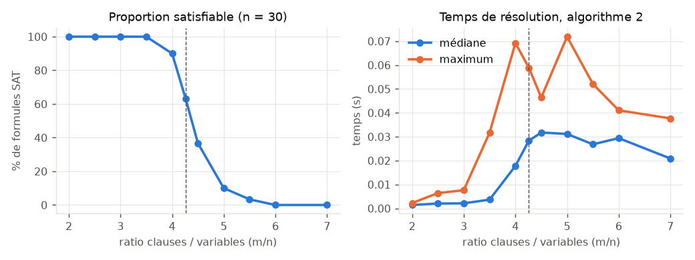
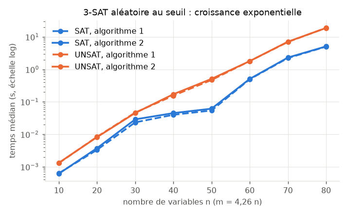

# Projet MLSF – Un solveur SAT pour Meowdoku – Partie I

*Rapport — binôme : Mateo Weill, Antoine Loudier — octobre 2026*

## Organisation du rendu

```
sat.py                 point d'entrée imposé (Question 6)
solver/
  dimacs.py            lecture / écriture DIMACS                       (Q2)
  dpll.py              algorithmes 1 et 2 de l'énoncé                  (Q2)
  heuristics.py        heuristiques de branchement H0..H7              (Q4)
  dpllh.py             algorithme 3, DPLL_H instrumenté                (Q4, Q5)
  stats.py             compteurs et chronométrage                      (Q5)
  optimized.py         solveur optimisé                                (Q6)
meowdoku/
  grid_io.py           lecture / écriture des grilles et solutions     (Q1, Q3)
  encode.py            grille -> CNF / DIMACS, et décodage             (Q1, Q3)
  verify.py            vérification directe des règles du jeu         (Q1, Q3)
  generate.py          générateur de grilles                           (Q1)
  solve_grid.py        résolution d'une grille                         (Q3)
tools/                 générateurs d'instances, validation, benchmarks
tests/                 tests automatiques (python tests/test_xxx.py)
instances/             instances DIMACS et grilles
bench/                 scripts et résultats des mesures                (Q2, Q5)
rapport/               ce rapport
```

Conventions communes à tout le code :

- **Python 3.12, bibliothèque standard uniquement** : c'est l'environnement de la
  compétition (`python:3.12-slim`), dans lequel on ne peut pas compter sur numpy ou
  autre paquet externe. Les tests sont exécutés sous Python 3.13 et 3.12 (3.12.15, obtenu avec `uv run --python 3.12`).
- Une **formule CNF** est une liste de clauses ; une **clause** est un `frozenset`
  d'entiers non nuls ; le littéral `k` représente $x_k$ et `-k` représente
  $\neg x_k$ (comme dans DIMACS). La justification est donnée en Question 2.
- Les scripts se lancent depuis la racine du projet (`python meowdoku/encode.py ...`).
  Toute sortie de diagnostic va sur `stderr`, pour que `stdout` reste réservé aux
  résultats (exigence de la Question 6).
- Chaque question fait l'objet d'un commit séparé, ce qui permet de retrouver dans
  l'historique git l'état du code à chaque étape.

Les écarts à l'énoncé et les coquilles relevées sont signalés dans le texte par
**[Écart]** et rassemblés en fin de rapport.

---

## Question 1 – Modélisation de Meowdoku

### 1.1 Format des grilles et choix d'interprétation

Le lecteur (`meowdoku/grid_io.py`) suit le format de la figure 1b. L'énoncé laisse
quelques points ouverts, que l'on a tranchés ainsi :

| Point | Choix | Justification |
|---|---|---|
| Sens de `GRID N M` | N lignes, M colonnes | cohérent avec $x_{i,j}$, $(i,j)\in\{1..N\}\times\{1..M\}$, et avec la figure 2 (« A 3 2 » = ligne 3, colonne 2 : on l'a vérifié sur la carte) |
| Ligne de commentaire | premier mot exactement `c` | une ligne de grille peut commencer par une région nommée `C` (ou `chat`) : « commence par la lettre c » serait ambigu |
| Noms de régions | mots quelconques séparés par des espaces | permet plus de 26 régions (le générateur utilise A…Z, AA, AB…) ; une ligne sans espaces (`ABCBBD`) est aussi acceptée si tous les noms font 1 caractère |
| Coordonnées | à partir de 1 | comme dans la figure 2 |

Le lecteur **vérifie que la grille est licite** : dimensions positives, N lignes de
M cases, régions toutes déclarées, sans doublon et **non vides**. Comme chaque case
reçoit exactement un nom de région, ces contrôles garantissent que les régions
forment une partition de la grille, comme l'exige l'énoncé. Toute anomalie lève une
`GridError` qui indique la ligne fautive.

### 1.2 Variables

On introduit exactement les variables demandées par l'énoncé, une par case :

$$x_{i,j} \text{ vraie} \iff \text{un chat est sur la case } (i,j), \qquad
\text{numéro DIMACS}(x_{i,j}) = (i-1)\cdot M + j \in \{1,\dots,NM\}.$$

La numérotation ligne par ligne est la plus simple à inverser :
$i = \lfloor (v-1)/M \rfloor + 1$ et $j = (v-1) \bmod M + 1$ (fonctions `var` et
`cell_of`). **Aucune variable auxiliaire** n'est ajoutée : on peut ainsi lire la
valuation témoin directement comme une configuration de chats, ce qui est le
décodage demandé.

### 1.3 Clauses

Notons $\mathrm{AMO}(S)$ (*at most one*) l'ensemble de clauses qui impose « au plus
une variable vraie dans $S$ ». On l'encode par l'**encodage binomial** (ou par
paires) : $\mathrm{AMO}(S) = \{\neg a \vee \neg b \mid \{a,b\}\subseteq S\}$, soit
$\binom{|S|}{2}$ clauses binaires. Chaque règle du jeu donne une famille de clauses :

| Règle | Clauses | Nombre (N = M = K = n) |
|---|---|---|
| R1 au plus un chat par ligne $i$ | $\mathrm{AMO}(\{x_{i,1},\dots,x_{i,M}\})$ | $n\binom{n}{2}$ |
| R2 au plus un chat par colonne $j$ | $\mathrm{AMO}(\{x_{1,j},\dots,x_{N,j}\})$ | $n\binom{n}{2}$ |
| R3a au moins un chat par région $R$ | $\bigvee_{(i,j)\in R} x_{i,j}$ | $K$ |
| R3b au plus un chat par région $R$ | $\mathrm{AMO}(\{x_{i,j} \mid (i,j)\in R\})$ | $\sum_R \binom{\lvert R\rvert}{2}$ |
| R4 pas de chats 8-adjacents | $\neg x_{i,j}\vee\neg x_{i',j'}$ pour $\max(\lvert i-i'\rvert,\lvert j-j'\rvert)=1$ | $\le 4n^2$ |

« Exactement un par région » est la conjonction de R3a et R3b. Pour R4, chaque paire
de cases voisines n'est engendrée qu'une seule fois : on ne regarde que les voisins
*après* $(i,j)$ dans l'ordre de lecture, c'est-à-dire droite, bas-gauche, bas et
bas-droite.

**Fusion des doublons.** Certaines clauses sont produites par plusieurs règles. Une
adjacence horizontale (R4) est déjà une clause de R1, une adjacence verticale une
clause de R2, et deux cases d'une même région sur une même ligne donnent la même
clause dans R1 et R3b. On a préféré **engendrer chaque règle littéralement** (le
code se lit comme l'énoncé, donc on peut le vérifier règle par règle), puis
**fusionner les clauses identiques** dans un dictionnaire, qui conserve l'ordre
d'insertion et donc un fichier reproductible. On aurait pu ne produire que les
adjacences diagonales, mais cette optimisation aurait rendu R4 incomplète prise
isolément. Les compteurs par règle sont écrits en commentaire du fichier DIMACS,
pour la traçabilité :

```
c grille 6x6, 6 regions : A B C D E F
c variable x(i,j) = (i-1)*6 + j  (chat en ligne i, colonne j)
c   R1 ligne<=1     : 90 clauses engendrees
c   R2 colonne<=1   : 90 clauses engendrees
c   R3a region>=1   : 6 clauses engendrees
c   R3b region<=1   : 172 clauses engendrees
c   R4 adjacence    : 110 clauses engendrees
c   total apres fusion des doublons : 309 clauses
p cnf 36 309
```

**Taille de la formule.** Avec $N=M=K=n$, la formule a $n^2$ variables et
$O(n^3 + \sum_R |R|^2)$ clauses. Le terme des régions dépend de la forme des
régions : dans le pire cas (une région quasi totale), il vaut $O(n^4)$. Mesures sur
des grilles produites par notre générateur (graine 1) :

| n | variables | clauses engendrées | clauses après fusion |
|---|---|---|---|
| 6 | 36 | 408 | 268 |
| 8 | 64 | 937 | 648 |
| 10 | 100 | 1 878 | 1 360 |
| 12 | 144 | 3 187 | 2 381 |
| 15 | 225 | 6 246 | 4 837 |
| 20 | 400 | 14 364 | 11 580 |
| 30 | 900 | 46 041 | 38 940 |

**Alternative écartée : encodages AMO compacts.** Les encodages *sequential counter*
(Sinz, 2005) ou *ladder* réalisent $\mathrm{AMO}(S)$ avec $O(|S|)$ clauses au lieu de
$O(|S|^2)$, mais ils introduisent des variables auxiliaires. L'énoncé demande une
formule portant sur les seules variables $x_{i,j}$. De plus, pour les tailles
visées ($n \le 30$, moins de 40 000 clauses), l'encodage binomial reste modeste, et
il propage mieux : dès qu'un $x$ devient vrai, une propagation unitaire suffit à
rendre fausses toutes les cases incompatibles, sans passer par des variables
intermédiaires.

**Clauses redondantes optionnelles (`--extra`).** Si $K = N$, on peut ajouter
« au moins un chat par ligne » (R5), et de même R6 pour les colonnes si $K = M$.
Ces clauses sont des **conséquences logiques** des règles. R3 impose exactement $K$
chats, puisque les régions sont disjointes et contiennent un chat chacune. R1
impose au plus un chat par ligne. Si $K=N$, les $N$ lignes en contiennent donc
exactement un chacune, par le principe des tiroirs. Ces clauses ne changent pas
l'ensemble des solutions, mais elles peuvent créer des clauses unitaires plus tôt
dans DPLL. Elles sont désactivées par défaut, pour rester fidèle à l'énoncé, et
leur effet sera mesuré en Question 5.

### 1.4 Validation de l'encodage

On veut établir que, pour toute valuation $v$, on a $v \models \mathrm{CNF}(G)$ si
et seulement si les cases où $v(x_{i,j})=1$ forment une solution de $G$.

Pour cela, `meowdoku/verify.py` implémente les quatre règles **directement**,
sans logique propositionnelle (simples comptages et tests de distance). On dispose
ainsi d'un oracle dont la correction se lit immédiatement sur le code. Les tests
(`tests/test_meowdoku.py`) vérifient alors :

1. la solution de la figure 2 satisfait la CNF de la grille de la figure 1, et
   déplacer un seul chat la fait échouer ;
2. **équivalence exhaustive** : sur 75 grilles aléatoires de tailles 2×2 à 4×4 (et
   2×6, 3×4, 4×3), avec $K$ aléatoire, et avec ou sans `--extra`, on parcourt les
   $2^{NM}$ valuations (jusqu'à 65 536 par grille), et on vérifie que la CNF est
   satisfaite **exactement** quand l'oracle déclare la configuration valide. Les
   grilles de test ont des germes quelconques et ne sont donc pas toujours
   solubles : 65 en ont au moins une solution, 10 n'en ont aucune. Les deux cas
   sont donc couverts. Ce test prouve, sur ces grilles, la **correction** (tout
   modèle est une solution) et la **complétude** (toute solution est un modèle) de
   l'encodage, y compris avec les clauses redondantes ;
3. les fichiers mal formés (région vide, non déclarée, ligne trop courte, etc.)
   sont refusés.

### 1.5 Générateur de grilles

`meowdoku/generate.py` produit des grilles **ayant au moins une solution par
construction**, par la méthode de la *solution plantée* :

1. **Placement des chats.** On tire $K$ lignes distinctes (toutes si $K=N$),
   triées, puis on choisit une colonne par ligne par **retour arrière en ordre
   aléatoire**. Deux contraintes s'appliquent : la colonne n'est pas déjà
   utilisée, et si la ligne précédente est adjacente, l'écart de colonne est au
   moins 2 (sinon contact diagonal). Deux chats sur des lignes non consécutives ne
   peuvent pas se toucher, donc ces contraintes suffisent à respecter R1, R2 et R4.
2. **Croissance des régions.** Chaque chat devient le germe d'une région. Toutes
   les régions grandissent simultanément selon un modèle de croissance d'Eden : on
   tire uniformément un couple (région, case libre 4-voisine de la région) dans la
   « frontière », et on rattache la case à la région, jusqu'à ce que toutes les
   cases soient prises.
3. **Nommage.** Les régions sont nommées A, B, C… dans l'ordre de lecture de leur
   première case, comme dans la figure 1.

*Correction.* Chaque région contient exactement un germe, et les germes respectent
R1, R2 et R4 : la configuration des germes est donc une solution. De plus, chaque
case est rattachée à exactement une région et chaque région contient son germe :
les régions forment une partition. Elles sont aussi **connexes**, comme dans le
jeu réel, car une case n'est rattachée à une région que si elle touche une case de
cette région. Tout cela est vérifié par les tests sur 100 grilles de 1×1 à 20×20.

*Cas traités.* Le cas général $N\times M$ avec $K \le \min(N,M)$ est accepté
(`python meowdoku/generate.py 5 7 4`). Le cas usuel $N=M=K$ s'obtient avec
`python meowdoku/generate.py 8`. Pour $N=M=K \in \{2,3\}$, aucune configuration
valide n'existe. Le retour arrière le prouve par recherche exhaustive et le
générateur l'indique. *Reproductibilité* : l'option `--seed` fixe la graine, qui
est aussi notée en commentaire dans la grille produite.

*Limite.* Une grille générée a **au moins** une solution, comme l'exige l'énoncé,
mais pas forcément une seule. Les grilles du jeu réel ont une solution unique. Une
option de génération à solution unique, qui nécessite le solveur, est ajoutée en
Question 3.

*Complexité.* La croissance coûte $O(NM)$ en espérance, car chaque case entre au
plus 4 fois dans la frontière. Le retour arrière est exponentiel dans le pire cas,
mais il trouve une solution quasi immédiatement pour $n \ge 4$, car les contraintes
sont peu serrées : une grille 30×30 est produite en quelques millisecondes.

**Commandes.**

```
python meowdoku/encode.py instances/meowdoku/grille1.txt              # -> grille1.cnf
python meowdoku/encode.py grille.txt -o sortie.cnf --extra
python meowdoku/generate.py 8 --seed 1 -o grille8.txt
python meowdoku/generate.py 10 --count 20 --dir instances/meowdoku/gen --seed 100 --cnf
python tests/test_meowdoku.py
```

---

## Question 2 – Lecture DIMACS et algorithme DPLL

### 2.1 Structure de données des formules

| Objet | Représentation Python |
|---|---|
| littéral $x_k$ / $\neg x_k$ | entier `k` / `-k` (comme DIMACS : aucune conversion) |
| clause | `frozenset` de littéraux |
| formule CNF | `list` de clauses |
| valuation | `set` de littéraux (`3` : $x_3 \leftarrow 1$, `-3` : $x_3 \leftarrow 0$) |

On a choisi le **`frozenset`** pour trois raisons. Le test « $l \in C$ », au cœur de
$F[l \leftarrow 1]$, se fait en temps constant. Les doublons d'une clause
(`1 1 2 0`) disparaissent d'eux-mêmes. Enfin, l'immuabilité permet de **partager**
sans risque les clauses non modifiées entre une formule et sa simplification :
$F[l\leftarrow 1]$ ne recopie que les clauses qui perdent $\neg l$, les autres sont
les mêmes objets. Une clause tautologique (`1 -1 0`) est conservée telle quelle :
elle disparaît dès que sa variable est affectée, et elle empêche à juste titre $x_1$
d'être vue comme un littéral pur.

Ce choix privilégie la **lisibilité et la correspondance avec l'énoncé**, où
$F[l\leftarrow b]$ est une nouvelle formule. Les structures plus efficaces (affectation
en place, littéraux surveillés) sont étudiées en Question 6.

### 2.2 Lecteur DIMACS (`solver/dimacs.py`)

La lecture standard traite les entiers comme un **flux** : chaque `0` ferme une
clause, quelles que soient les fins de ligne. On accepte ainsi les clauses sur
plusieurs lignes ou plusieurs clauses par ligne, qui sont courantes dans les
benchmarks. Les lignes `c` sont ignorées, et un `%` isolé, qui marque la fin des
fichiers SATLIB, arrête la lecture. Un en-tête absent ou invalide, un jeton non
entier ou une variable supérieure au nombre annoncé lèvent une `DimacsError`.

**Fichiers mal formés réels.** En validant sur SATLIB (§2.4), deux défauts sont
apparus, que le premier lecteur traitait **incorrectement** :

- les 8 fichiers `pret*.cnf` se terminent par un `0` isolé. Lu comme une clause
  vide, il rend *n'importe quelle* formule insatisfiable. C'est sans conséquence
  visible ici, car ces formules sont effectivement UNSAT, mais ce serait faux pour
  une formule SAT ;
- dans `dubois100.cnf`, certaines lignes n'ont pas de `0` final. La lecture en flux
  fusionne alors deux clauses en une seule clause de 6 littéraux, ce qui
  **affaiblit** la formule. On lisait 598 clauses au lieu des 800 annoncées.

Le nombre de clauses annoncé dans l'en-tête sert donc de contrôle. En cas d'écart,
le lecteur ignore d'abord les clauses vides en surnombre en fin de fichier. Si l'écart
persiste, il essaie une lecture **ligne par ligne** (une ligne = une clause, comme le
dit l'énoncé), et ne la retient que si elle donne exactement le nombre annoncé.
Toute correction est signalée sur `stderr`. Une vraie clause vide, comptée dans
l'en-tête, est conservée. Ces cas sont couverts par `test_parseur_robuste`.

### 2.3 Algorithmes 1 et 2 (`solver/dpll.py`)

`dpll_v1` et `dpll_v2` suivent l'énoncé ligne à ligne, et les numéros de ligne sont
indiqués en commentaire dans le code. Les opérations élémentaires sont les suivantes :

| Fonction | Rôle | Coût |
|---|---|---|
| `simplify(F, l)` | $F[l\leftarrow 1]$ : retire les clauses contenant $l$, retire $\neg l$ des autres | $O(\lvert F\rvert)$ |
| `has_empty_clause` | ligne 1 | $O(m)$ |
| `find_unit` | ligne 5 : première clause de taille 1 | $O(m)$ |
| `find_pure` | ligne 7 : union des littéraux, puis recherche d'un $l$ sans $\neg l$ | $O(\lvert F\rvert)$ |
| `random_choice` | ligne 9 / `RandomChoice` : variable uniforme parmi celles de $F$, valeur uniforme | $O(\lvert F\rvert)$ |

Ici $m$ est le nombre de clauses et $|F|$ le nombre total d'occurrences de littéraux.

Choix et précisions :

- **Retour de l'algorithme 2.** On renvoie `(True, v)` ou `(False, None)`, ce qui
  correspond au $(\mathrm{UNSAT}, 0)$ de l'énoncé. La valuation est construite **à la
  remontée** : $v \cup \{l\}$ est un simple `add` sur l'ensemble renvoyé par l'appel
  récursif. Il n'y a donc pas de copie, et le coût n'est payé que sur la branche
  gagnante.
- **Unitaire et pur.** Les deux cas ont un traitement identique dans l'algorithme 2
  (lignes 5-10 et 11-16 : une seule branche, sans retour arrière). Le code les
  factorise, en essayant d'abord le littéral unitaire.
- **Modèle complet.** Une variable peut disparaître de $F$ sans être affectée, quand
  toutes ses clauses sont déjà satisfaites. Elle peut alors prendre n'importe quelle
  valeur, et `complete_model` lui donne la valeur faux, pour produire un modèle sur
  $x_1..x_n$, comme le demande la Question 6.
- **Hasard reproductible.** `random_choice` tire avec un `random.Random(seed)` et trie
  les variables avant le tirage, car l'ordre d'itération d'un `set` n'est pas une
  fonction de la graine. Une exécution est donc entièrement déterminée par sa graine.
- **Profondeur de récursion.** Chaque appel affecte au moins une variable présente
  dans $F$, qui en disparaît. La profondeur est donc au plus $n+1$, et `solve` relève
  la limite de Python, qui vaut 1000 par défaut. C'est testé avec une chaîne de 3000
  implications.

*Correction.* La **terminaison** découle de ce que chaque appel retire au moins une
variable. Pour la **correction**, on utilise trois faits :

1. si $\{l\}\in F$, toute valuation qui satisfait $F$ rend $l$ vrai, donc $F$ est
   satisfiable si et seulement si $F[l\leftarrow 1]$ l'est ;
2. si $l$ est pur, et si $v \models F$, alors $v[l\leftarrow 1] \models F$, car rendre
   $l$ vrai ne peut falsifier aucune clause, puisque $\neg l$ n'apparaît nulle part ;
   donc $F$ est satisfiable si et seulement si $F[l\leftarrow 1]$ l'est ;
3. $F$ est satisfiable si et seulement si $F[p\leftarrow b]$ ou
   $F[p\leftarrow \bar b]$ l'est.

Par récurrence sur le nombre de variables, la valuation renvoyée satisfait $F$, et
de plus elle est vérifiée systématiquement.

### 2.4 Validation

Les fichiers des enseignants n'étant pas encore disponibles, la validation repose sur
trois niveaux. Le même outillage s'appliquera tel quel à leurs fichiers
(`python tools/validate.py <dossier>`).

1. **Tests unitaires et oracle de force brute** (`tests/test_dpll.py`) : opérations
   élémentaires sur l'exemple de l'énoncé, cas limites (formule vide, clause vide,
   $x\wedge\neg x$, tautologie), lecteur, puis **600 formules aléatoires** de 3 à 12
   variables (343 SAT, 257 UNSAT). Ces formules sont résolues par les deux algorithmes
   avec 3 graines chacune, et comparées à l'énumération des $2^n$ valuations. Chaque
   modèle est vérifié.
2. **Instances de référence.** On a ajouté **162 instances SATLIB** (`instances/satlib/`),
   la bibliothèque de référence d'où proviennent la plupart des jeux de test de
   DPLL :
   - 3-SAT aléatoire `uf`/`uuf` de 20 à 100 variables ;
   - coloration de graphes `flat` ;
   - tiroirs `hole` ;
   - `aim`, `dubois`, `pret`, `par`.

   S'y ajoutent nos instances : lampes, Meowdoku, `rand3sat` et `php` produits par
   `tools/gen_cnf.py`. Le **statut attendu** est calculé par un solveur de référence
   indépendant, MiniSat 2.2, via `python-sat` utilisé comme *outil de développement
   uniquement*. Il est enregistré dans `instances/expected.csv`
   (`tools/oracle.py`) et confronté au statut annoncé par SATLIB : il n'y a aucune
   discordance.
3. **Validation automatique** (`tools/validate.py`) : chaque instance est résolue
   dans un sous-processus avec un délai de 60 s. Le statut est comparé à l'oracle, et
   chaque modèle est vérifié contre **toutes** les clauses.

**Résultat : aucune réponse fausse.** Sur 181 instances × 2 algorithmes, il y a 254
réponses justes et 108 délais dépassés. Détail par famille, identique pour les deux
algorithmes (le détail complet est dans `bench/results/q2_validation.md`) :

| Famille | Statut | Instances | Résolues en 60 s | Temps moyen (s) |
|---|---|---|---|---|
| lampes, grille 1, Meowdoku générées 6 à 12 | SAT | 6 | 6 | ≤ 0,15 |
| uf20 / uf50 / uf75 / uf100 | SAT | 20 / 10 / 5 / 5 | toutes | 0,002 / 0,14 / 1,7 / 26 |
| uuf50 / uuf75 / uuf100 | UNSAT | 10 / 5 / 5 | 10 / 5 / **1** | 0,42 / 8,7 / 55 |
| rand3sat (nos 3-SAT, n = 20, 50, 75) | les deux | 9 | 9 | ≤ 4,8 |
| php (nos tiroirs, 3 à 6 trous) | UNSAT | 4 | 4 | 0,05 |
| hole6 à hole10 | UNSAT | 5 | 3 (6 à 8) | 2,6 |
| flat30 / flat50 | SAT | 5 / 3 | toutes | 0,006 / 0,64 |
| aim-50 | les deux | 24 | 24 | ≤ 9 |
| aim-100 | les deux | 24 | **7** | ≤ 14 |
| par8 / par16 | SAT | 10 / 10 | 10 / **0** | 0,2 / – |
| dubois (60 à 300 var.) | UNSAT | 13 | **0** | – |
| pret (60 et 150 var.) | UNSAT | 8 | **0** | – |

### 2.5 Performances

**Coût d'un nœud.** Chaque appel récursif fait plusieurs parcours complets de la
formule courante (clause vide, unitaire, pur, simplification), soit $O(|F|)$ par
nœud. Il garde aussi sa propre copie simplifiée de $F$ tant que ses descendants
s'exécutent, soit une mémoire en $O(n\cdot|F|)$ au pire. Le nombre de nœuds est
exponentiel dans le pire cas, en $O(2^n)$. Le **profilage** de l'algorithme 2 sur
`uuf50-01` (7 147 appels, 1,7 s, soit environ 240 µs par nœud) donne la répartition
suivante :

| Poste | Part du temps |
|---|---|
| recherche de la clause vide (`has_empty_clause`, un parcours complet à chaque appel) | ≈ 40 % |
| simplification $F[l\leftarrow 1]$ | ≈ 35 % |
| choix de variable (`variables`) et clause unitaire | ≈ 20 % |

Ce sont des coûts **structurels**. Le nombre de nœuds est inévitable sans meilleure
heuristique (Question 4), mais le coût par nœud tomberait si l'on détectait la clause
vide pendant la simplification, et surtout si l'on affectait en place au lieu de
recopier (Question 6).

Les mesures (`bench/bench_q2.py`, résultats dans `bench/results/q2_*.csv`) sont prises
en sous-processus, le temps de lecture du fichier étant exclu.

**Transition de phase** (3-SAT aléatoire, n = 30, 30 formules par ratio m/n) :



La proportion de formules SAT passe de 100 % à 0 % autour de $m/n \approx 4{,}26$, le
seuil connu du 3-SAT aléatoire. Le temps est maximal autour de ce seuil, et c'est
**conforme à l'intuition**. En dessous, il y a peu de contraintes et une solution est
trouvée presque sans retour arrière. Au-dessus, il y a tant de contraintes que les
propagations unitaires referment vite chaque branche. Pour n = 30, la décroissance à
droite reste modeste ; elle s'accentue avec n.

**Croissance avec n** (au seuil m = 4,26 n, 20 formules par taille, médianes) :



| n | 40 | 50 | 60 | 70 | 80 |
|---|---|---|---|---|---|
| SAT, médiane (s) | 0,045 | 0,062 | 0,51 | 2,3 | 5,1 |
| UNSAT, médiane (s) | 0,17 | 0,51 | 1,8 | 7,1 | 18,8 |

- **Croissance exponentielle** : le temps des instances UNSAT est multiplié par environ
  3,3 pour 10 variables de plus, soit environ $2^{n/5,8}$. Avec la limite de 60 s de la
  compétition, le DPLL de base plafonne vers n ≈ 90 sur ce type d'instances : uuf100
  n'est résolu qu'une fois sur 5.
- **UNSAT est plus coûteux que SAT**, d'un facteur 3 à 8 pour un même n. Pour prouver
  l'insatisfiabilité, il faut parcourir **tout** l'arbre de recherche, alors qu'une
  formule SAT s'arrête à la première feuille satisfaisante. Les temps SAT sont aussi
  plus dispersés (rapport max/médiane plus élevé), car tout dépend du moment où l'on
  tombe sur une bonne branche.
- **Algorithmes 1 et 2 : même coût.** Le rapport médian des temps est de 1,007 (de 0,88
  à 1,43 selon l'instance, ce qui relève du bruit de mesure). C'est attendu : avec la
  même graine, les deux algorithmes appellent `random_choice` dans le même ordre sur
  les mêmes formules, et parcourent donc **exactement le même arbre**. Le seul surcoût
  de l'algorithme 2 est un `add` par niveau sur la branche gagnante, négligeable
  devant le $O(|F|)$ de chaque nœud.

**Effet du hasard** (20 graines sur une même instance) :

| Instance | min | médiane | max | max / min |
|---|---|---|---|---|
| uf50-01 (SAT) | 0,007 | 0,33 | 0,76 | ×110 |
| uuf50-01 (UNSAT) | 0,31 | 0,48 | 0,79 | ×3 |
| flat30-1 (SAT) | 0,007 | 0,015 | 0,093 | ×13 |
| Meowdoku 10×10 (SAT) | 0,028 | 0,051 | 0,63 | ×22 |

Sur une instance SAT, une graine chanceuse trouve la solution presque sans retour
arrière, ce qui donne un facteur 110 entre la meilleure et la pire graine. Sur une
instance UNSAT, tout l'arbre doit être exploré et le hasard ne change que sa forme :
facteur 3 seulement.

**Instances structurées.**

- **Tiroirs** : 0,2 s pour hole6, 1,7 s pour hole7, 12,5 s pour hole8, puis
  dépassement du délai. Le facteur d'environ 8 par trou supplémentaire illustre un
  résultat théorique : toute preuve par résolution du principe des tiroirs, donc
  toute exécution de DPLL, est de taille exponentielle (Haken, 1985). Aucune
  heuristique de branchement ne peut l'éviter.
- **dubois, pret, par16** : elles ne sont jamais résolues en 60 s, bien qu'elles
  n'aient que 60 à 300 variables. Ces formules encodent des chaînes de contraintes de
  parité (XOR). Sans apprentissage de clauses, DPLL redécouvre indéfiniment les mêmes
  conflits dans des branches différentes. Cela motive les techniques de la Question 6.
- **Meowdoku** (grilles générées, 3 graines de grille × 3 graines de solveur) : moins
  de 0,2 s jusqu'à 13×13 dans la grande majorité des cas, mais avec une **queue
  lourde**. Sur une même grille 14×14, on observe 0,2 s, 17 s ou plus de 60 s selon la
  graine du solveur. Le choix aléatoire de la variable est donc le point faible pour
  notre application : c'est l'objet de la Question 4.

```
python tests/test_dpll.py
python tools/oracle.py                       # recalcule instances/expected.csv (python-sat)
python tools/validate.py [dossier] --timeout 60 --csv bench/results/q2_validation.csv
python bench/bench_q2.py tout                # mesures (≈ 20 min)
python bench/plots.py q2                     # figures (matplotlib)
```

---

## Question 3 – Résolution d'une grille

### 3.1 Chaîne de traitement (`meowdoku/solve_grid.py`)

```
grille.txt --read_grid--> Grid --encode--> fichier .cnf --read_dimacs--> CNF
           --solveur SAT--> modèle --decode--> {région: (i, j)} --verify--> solution.txt
```

1. La grille est lue et contrôlée (§1.1).
2. Elle est encodée (§1.3), et **un vrai fichier DIMACS est écrit puis relu**. On
   pourrait passer les clauses en mémoire, mais l'énoncé demande de déléguer la
   recherche au solveur *via* la conversion en DIMACS, et ce passage teste au passage
   l'écriture et la lecture du format. Le fichier est temporaire, sauf avec
   `--cnf chemin`.
3. Le solveur choisi (`--solver`) résout la formule. Par défaut, c'est l'algorithme 2.
   Le registre `SOLVEURS` recevra les solveurs des questions 4 et 6. Le modèle est
   revérifié contre la CNF, par prudence.
4. **Décodage** : chaque littéral positif $x_v$ donne la case $(\lfloor (v-1)/M\rfloor+1,
   (v-1)\bmod M+1)$, associée à sa région. `decode` lève une erreur si une région n'a
   pas exactement un chat.
5. **Vérification systématique, à deux niveaux.** La configuration décodée est
   d'abord passée au vérificateur direct des règles (`verify.violations`). Puis le
   **fichier produit lui-même** est relu depuis son texte (`check_solution_text`). Ce
   second contrôle vérifie, en plus des règles, que le dictionnaire et la carte
   décrivent la même configuration et que chaque chat est bien dans la région
   annoncée. Une solution qui échoue n'est jamais écrite.
6. **Sortie au format de la figure 2** : le fichier d'entrée est recopié *tel quel*
   (commentaires compris), suivi du dictionnaire région → (ligne, colonne) dans l'ordre
   de la ligne `ZONES`, puis de la carte en `*` et `.`. Pour la grille de l'énoncé, la
   sortie est **identique** à la figure 2, ce que vérifie un test.

Si la formule est insatisfiable, le programme le signale sur `stderr` et renvoie le
code 2. Cela peut arriver pour une grille licite mais mal conçue, jamais pour une
grille de notre générateur.

### 3.2 Énumération et grilles à solution unique

`count_solutions(grid, limite)` énumère les solutions par **clauses de blocage**. Après
une solution $S$, on ajoute la clause $\bigvee_{(i,j)\in S}\neg x_{i,j}$, qui interdit
exactement $S$ : toute autre configuration de $K$ chats laisse vide au moins une case
de $S$.

Cette fonction permet d'ajouter au générateur l'option **`--unique`**, annoncée en
§1.5, par une **réparation itérative** de la grille plantée de solution $S_1$. Tant
qu'il existe une autre solution $S_2$ :

- on choisit une case $c$ portant un chat de $S_2$ mais pas de $S_1$. Il en existe
  une, car $S_1 \ne S_2$ et elles ont toutes deux $K$ chats ;
- on rattache $c$ à une région voisine $R'$, à condition que sa région d'origine reste
  connexe sans elle.

Dans $S_2$, la région $R'$ contient alors deux chats ($c$ et son chat d'origine), donc
$S_2$ est éliminée. $S_1$ reste valide, car $c$ ne porte pas de chat de $S_1$ et aucun
chat de $S_1$ ne change de région. Une retouche peut créer de nouvelles solutions, d'où
l'itération, avec un nombre maximal d'étapes et un redémarrage en cas d'échec. En
pratique, il faut 0 à 20 retouches jusqu'à 10×10. Le coût est dominé par la **preuve
d'unicité**, qui revient à montrer qu'une formule est UNSAT. Avec le DPLL de base,
cela prend moins de 4 s jusqu'à 9×9, mais environ 50 s pour 10×10, ce qui confirme le
coût élevé des instances UNSAT observé au §2.5. Le solveur de la Question 6 pourra
être branché ici (paramètre `solveur`).

### 3.3 Validation (`tests/test_solve_grid.py`)

- **Figure 2** : le programme, lancé en ligne de commande sur la grille de l'énoncé,
  produit exactement le fichier de la figure 2.
- **40 grilles générées** (de 4×4 à 9×9, et non carrées 5×7 avec K = 4, 8×6 avec
  K = 5) : elles sont résolues, et chaque fichier solution est revérifié.
- **Comptage contre énumération directe.** Avec $N=M=K$, une solution est une
  permutation lignes → colonnes. On les teste toutes avec `verify`, sans SAT, et
  l'ensemble obtenu doit coïncider avec celui énuméré par le solveur. C'est fait pour
  18 grilles de 4×4 à 6×6. Le même oracle confirme l'unicité des grilles `--unique`
  (5×5 à 7×7) ainsi que l'absence de solution d'une grille insoluble construite à la
  main.
- **Fichier falsifié** : un dictionnaire qui ne correspond pas à la carte, ou un chat
  déplacé contre un autre, est détecté.

```
python meowdoku/solve_grid.py instances/meowdoku/grille1.txt              # sur stdout
python meowdoku/solve_grid.py grille.txt -o solution.txt --cnf grille.cnf
python meowdoku/verify.py solution.txt                                    # revérifier un fichier
python meowdoku/generate.py 8 --unique --seed 3 -o grille8u.txt
python tests/test_solve_grid.py
```

---

## Usage des assistants IA

Le projet a été réalisé avec l'aide de Claude (Anthropic) dans l'éditeur, via
l'extension Claude Code. Le principe a été le suivant : l'assistant propose du code
et des justifications, question par question ; chaque choix est relu, testé et
documenté dans ce rapport avant d'être intégré au dépôt (un commit par question).
Les points où l'énoncé laissait une marge d'interprétation sont signalés
explicitement. Les tests ont été conçus pour ne pas dépendre de la confiance
accordée au code produit : ils comparent avec des oracles indépendants (force
brute, vérificateur direct des règles du jeu).

- **Q1** : proposition de l'encodage et du générateur par l'assistant ; la
  validation repose sur le test d'équivalence exhaustive (§1.4), qui ne dépend
  d'aucune hypothèse sur le code d'encodage.
- **Q2** : les algorithmes 1 et 2 et le lecteur DIMACS avaient été écrits en amont. La
  relecture et la validation avec l'assistant ont mis en évidence deux défauts du
  lecteur sur des fichiers SATLIB réels (§2.2), qui ont été corrigés. L'assistant a
  aussi proposé l'oracle MiniSat, l'outillage de validation et de mesure, et
  l'analyse des performances. Chaque chiffre cité provient des fichiers CSV de
  `bench/results/`.
- **Q3** : chaîne de résolution, vérification à deux niveaux et génération à solution
  unique proposées par l'assistant. La preuve que la réparation élimine $S_2$ sans
  casser $S_1$ (§3.2) est à maîtriser pour la soutenance.

---

## Écarts à l'énoncé et points d'interprétation

- **[Q1]** `GRID N M` est lu comme N lignes, M colonnes (§1.1). Une ligne de
  commentaire est une ligne dont le premier mot est `c`.
- **[Q1]** Encodage sans variable auxiliaire, comme demandé, avec une option
  `--extra` de clauses redondantes, désactivée par défaut.
- **[Q2]** Le lecteur DIMACS tolère deux défauts présents dans des fichiers SATLIB
  réels (§2.2). Pour un fichier bien formé, il se comporte exactement comme la lecture
  standard.
- **[Q2]** Les fichiers DIMACS des enseignants n'étant pas disponibles au moment de la
  rédaction, la validation porte sur SATLIB et nos instances. L'outil
  `tools/validate.py` s'appliquera tel quel à leurs fichiers.
- **[Q3]** L'énoncé suppose qu'une solution existe. Si ce n'est pas le cas, le
  programme le signale (code de retour 2) au lieu d'écrire un fichier.
